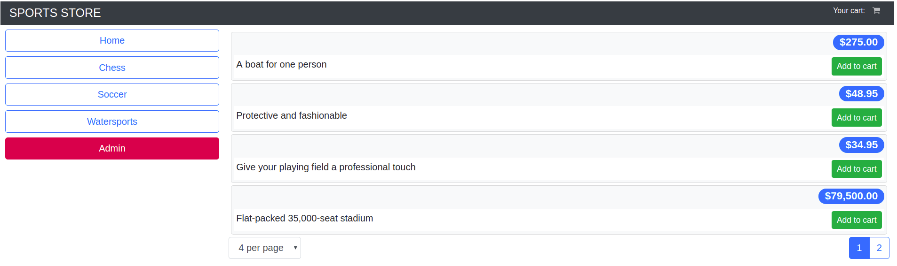
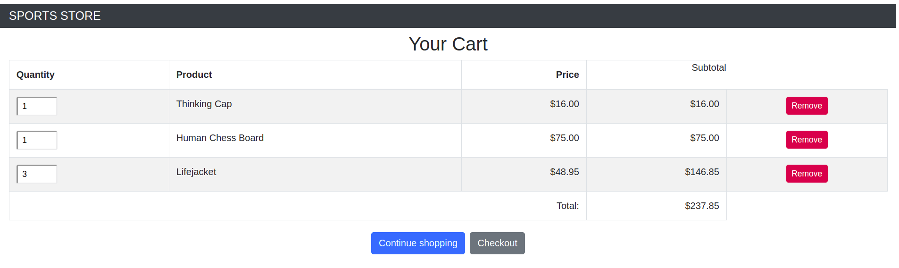
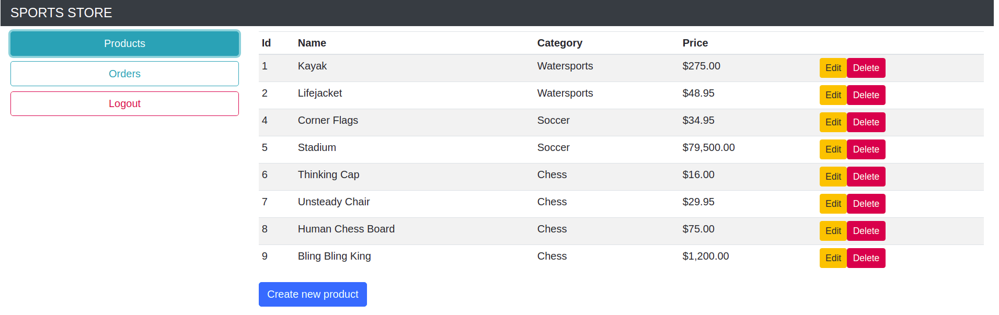
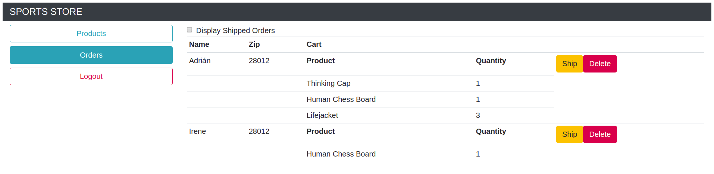

# SportsStore

This project was generated with [Angular CLI](https://github.com/angular/angular-cli) version 7.3.8.

Users can navigate through a products list and filter them by categories. They can add products to the shopping cart and complete an order.

Admin users can check orders and mark them as shipped. They can also create, edit and remove products.

To access admin section you need to use the following credentials:

**username:** admin
**password:** secret

## How to run the applicatoin

Run `npm install` to install every project dependency.

Run `npm run json` to start json-server on `http://localhost:3500/`.

Run `ng serve` for a dev server. Navigate to `http://localhost:4200/`.
